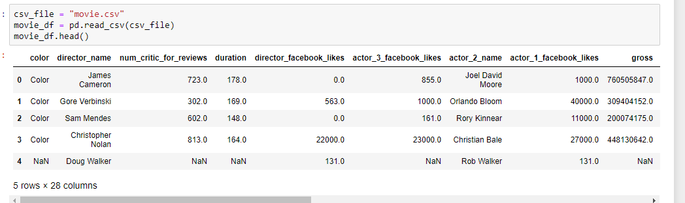
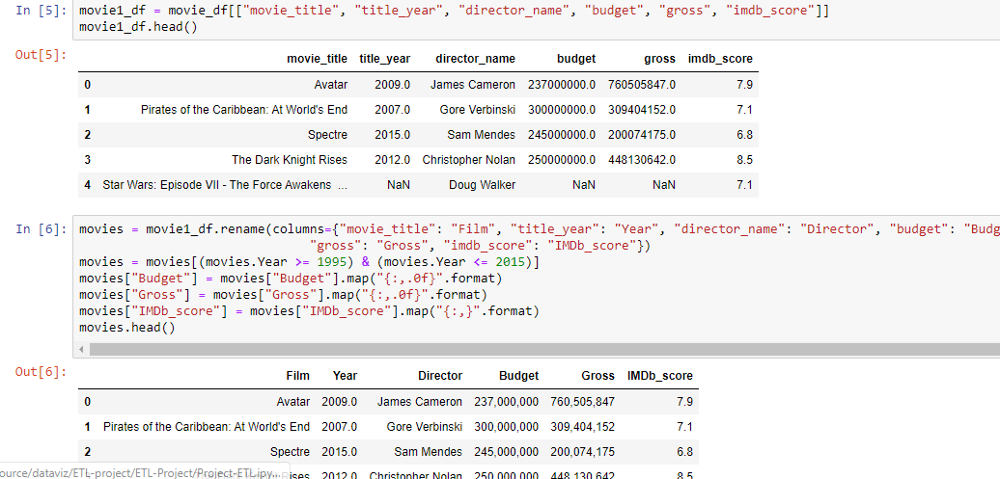
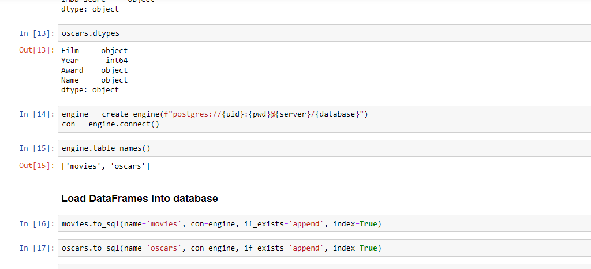

# ETL-Group Project
Group project that we read csv files from 2 different data sets and then loaded into Sql then loaded back into a new set.
We worked with Oscar winners and Rotten Tomatoes reviews to see if there was any correlation between avg user reviews and critics.

![movie3}(oscar3.PNG)

